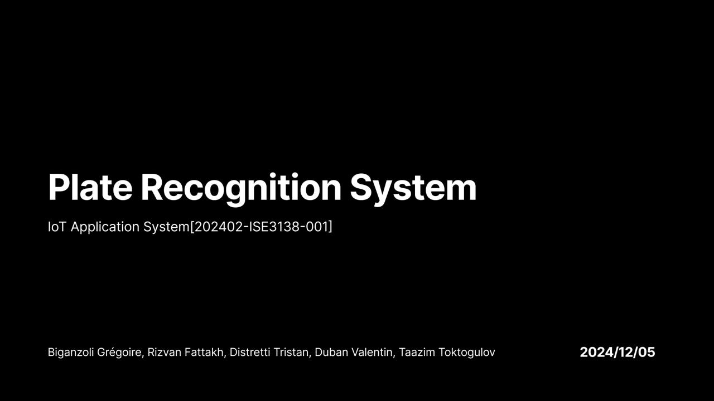
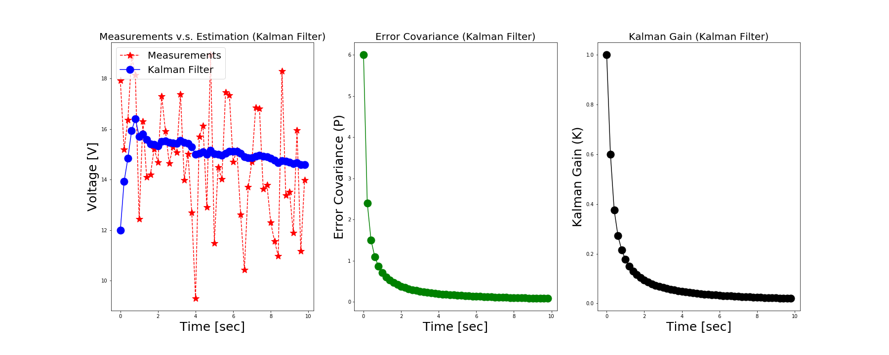
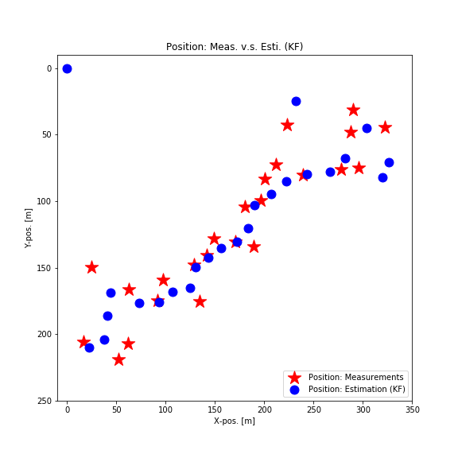

# [View the Figma Presentation](https://www.figma.com/slides/isMGHzAQKJRi6pEmfdWJ7k/IoT-Presentation?node-id=72-41&t=1agCovRzLNVKUNdG-1)

# PlateRecognitionSystem-IoT
Related Work: Overview of existing solutions, strengths, and limitations.Proposed Solution: High-level description of your approach or methodology.
Technical Architecture: AI model/algorithm pipeline and workflow.
Dataset: Details about the dataset(s) used, including preprocessing steps.
Implementation: Tools, frameworks, and technical setup.
Results: Quantitative metrics (accuracy, precision, etc.) and qualitative outputs (sample images).
Evaluation and Comparison: Benchmark results and strengths of your approach.
Challenges and Limitations: Issues faced and current limitations.
Future Work: Possible extensions or improvements.

# Related Work: 
During the whole project implementation we were based on experience of Kazakh AI Company, that implementing solutions for city traffic monitoring system - Sergek. Fattakh worked as a Data Science Intern with Sergek, and brought some expertise from them. The main strengths of Sergek's monitoring system is a range of data and access to data-sources that government collecting. That the main point why Sergek are capable to make those powerful AI detection systems, they can detect small traffic violation, like: using phone while driving, not being buckled up, and etc. Moreover, Sergek collecting all experts in AI field and having the biggest research team in Kazakhstan for AI. So, main points of successful project in detection: 1. Be data-driven, capable for collect, preprocess, and have access to big amount of data. 2. Try to put mush as possible to Research and analyzing the optimization approaches: gradient boosting, pruning, quantization, and etc. 

# Solution
Our approach, methodology relies on dataset power and collect most practical expertises in detection systems, in order to find efficient strategy. We researched a bunch of articles on models optimization, advanced ML/AI models in detection systems, and asked professionals in those field in order to help us(I really will do that, if there is no answer, we will delete that detail). 

# Technical Architecture 
Our architecture based on MobileNetV2 and Gradient boosting library - Catboost by Yandex(having the most capable expertise in ML/AI in CIS, even in Europe, based on big range of academical and corporate impact) for model optimization. The MobileNetV2 architecture is based on an inverted residual structure where the input and output of the residual block are thin bottleneck layers opposite to traditional residual models which use expanded representations in the input an MobileNetV2 uses lightweight depthwise convolutions to filter features in the intermediate expansion layer. CatBoost is an algorithm for **gradient boosting on decision trees**. It is developed by Yandex researchers and engineers, and is used for search, recommendation systems, personal assistant, self-driving cars, weather prediction and many other tasks at Yandex and in other companies, including CERN, Cloudflare, Careem taxi. It is in open-source and can be used by anyone. 

# Dataset
Our dataset is combination between couple datasets that we found on kaggle, there was not enough amount of images in datasets, so our Data Science Lead decided to combine dataset in order to maximize the accuracy and results of final model. Dataset: https://www.kaggle.com/datasets/saisirishan/indian-vehicle-dataset/data, https://www.kaggle.com/datasets/dataturks/vehicle-number-plate-detection/data, https://huggingface.co/datasets/keremberke/license-plate-object-detection. 

# Implementation 
For implementing our architecture we were using initially TensorFlow, but then decided to use PyTorch because of wide inconvenience of TensorFlow library. For gradient boosting we used Catboost library by Yandex, for cross validation and trying to implement population training we used scikit-learn. For basic data preprocessing and augmentation: pandas, plotly, XML.etree, CV2. For model training we used Google colab T4(GPU) resources. 

# Results
MSE for each bounding box coordinate: [0.02412456 0.00886813 0.02148489 0.00385014] Overall MSE: 0.014581931945508506
The F1 score on validation set was approximately 0.5-0.6 during the feature extraction part for gradient boosting, the whole F1 score increased to 0.7-0.8 it is the best what we achieved during the training process. 
There is issues with photos that was made with augmentation problems, where it is hard for model to detect plate because of high angle or plate unreadability. 
![[Screenshot 2024-11-28 at 10.44.00.png]]

# Challenges and limitation 
How I mentioned before the main problem and our backbone part is dataset, inventing data preprocessing method, and try to minimize the issues related to dataset, because we believe that data-driven approach in every project, product, or corporation it's key for success, it is really essential. But further we just combined and invented ourselves dataset using three others. Then there is were problem with model optimization, because results on MobileNetv2 by itself were not satisfying, so introduced gradient boosting in order to replace population training, Catboost it is tremendously capable library for optimizing and training models, having really scalable and simple implementation process. So, main problems were related to dataset and model optimization. 

# Future work
Our future work are directed for further development and deployment of the model on business process such as parking lot managing, traffic monitoring, violation detection systems. We want to implement our approach and methodology further using web application development, data engineering, and server-side architecture of model running. Nvidia DeepStream SDK implementation.

# UPD:
## Future work
Apparently, utilizing and power of todays computational resources are averagely high, so there is no need in using mobilenetv2, it will only decrease accuracy and lead problems with model optimizing. We are planning to transfer the whole pipeline on Nvidia DeepStream SDK, and apply our new YOLO based architecture. Moreover, we need to apply advanced data labeling and try to apply population training on different data labeling approaches. Maybe apply Kalman filter to try decrease the noise on image. It is very essential for image processing. https://github.com/tbmoon/kalman_filter/tree/master. 

## Last words:
We decided to not use pruning because of mobilenetv2 architecture nature, it strongly convolutional depth wise neural network with relatively small amount of parameters. During testing the pruning results we noticed that accuracy of the whole model falls relatively drastically with losing inference power. Moreover, there is no need in optimizing, over-tuning model, because mobilenetv2 with gradient boosting - it is enough to put model on microcontroller and the whole architecture will be power efficient - with low tdp and memory consumption. Using quantization leading to same problems with inference power and accuracy loss, with small impact on power efficiency. So we decided not to use techniques for model weights, activations, and layers compression. Instead we want to introduce idea of transferring our approach to YOLO V6-7 architecture with applying catboost that fits our task - plate recognition. Moreover, we want to try more practically convenient approach - using AI/ML SDK from Nvidia. 

## Some illustrations of the kalman filter work

## Clear-Air project details (the project that gave us a lot of basis in implementation and influence on work pipeline)

Link to article about the project: https://esquire.kz/sergeki-budut-sledit-za-chistotoj-vozduha-v-almaty/

Researching algorithms that will reduce the air pollution in Almaty by detecting the most ecologically damaging transport. Stack: NumPy, matplotlib, pandas, jupyter, etc.

On 5th May, our team successfully presented the final project to the CEO and Owner of InDrive Arsen Tomsky. Overall the product and accomplished work impressed audience with high level of technological approach and algorithm that we developed. During next month, we will receive code review from Sergek Development IT department.

About our project and the whole ecological problem of Almaty Kana Baisekeyeb shot a film, where CEO of Indrive and CEO of Sergek were discussing about ecology issues and projects that can resolve the problem - our Clear-Air project. 
Video about the ecology problem in Almaty city and our project: https://www.youtube.com/watch?v=tderLxHdLy0&t=2902s
